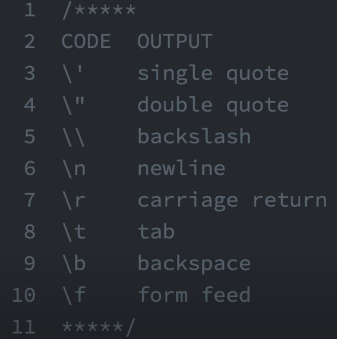

## Plus
var sum = 5 + 6;
## Second way of Plus
var num = 3;
num += 12

## Minus
var sum2 = 6 - 5;
## Second way of Plus
var num1 = 15;
num1 -= 6

## Miltipication
var sum3 = 5 * 6;
## Second way of Plus
var num2 = 3;
num2 *= 5

## Divition 
var sum4 = 66 / 33;
## Second way of Plus
var num = 12;
num /= 3

## incrementing
var myVar = 5;
myVar++;

## decrementing
var myVar2 = 5;
myVar2--;

## remainder
var remainder = 11 % 3;

## Escaping literal quotes
var myStr = "I am a \"double quoted\" string inside \"double quotion\""

